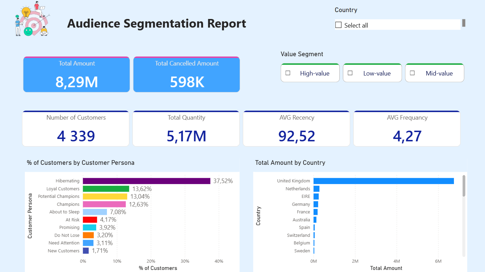

# Audience Segmentation for E-Commerce — RFM Analysis & Power BI Dashboard

An end-to-end customer segmentation project on the [Online Retail dataset from Kaggle](https://www.kaggle.com/datasets/ulrikthygepedersen/online-retail-dataset): cleaning ~542K raw transactions, building an RFM (Recency, Frequency, Monetary) model, scoring and labeling 4,339 customers into ten actionable personas, and visualizing the results in an interactive Power BI dashboard.



## Table of Contents

- [Project Overview & Goals](#project-overview--goals)
- [Repository Structure](#repository-structure)
- [Methodology](#methodology)
- [Executive Summary](#executive-summary)
- [Recommendations](#recommendations)
- [Limitations](#limitations)
- [How to Reproduce](#how-to-reproduce)

## Project Overview & Goals

A UK-based online retailer has thirteen months of transaction history but no way to answer a basic question: **which customers actually matter, and what should the business do about each group?**

This project answers that in three stages:

1. **Clean** raw, transaction-level order data into a reliable analytical base.
2. **Score** every customer on Recency, Frequency, and Monetary value, and translate those scores into ten named personas (Champions, At Risk, Hibernating, etc.).
3. **Visualize** the result in a Power BI dashboard a marketing or CRM team could actually use to prioritize outreach.

**Goals:**
- Quantify how much of the business's revenue and customer base each segment represents.
- Separate genuine purchase value from returned/cancelled value, since gross revenue alone overstates what a customer is really worth to the business.
- Produce a single, dashboard-ready customer table that needs no further joins.

## Repository Structure

```
audience-segmentation-ecommerce/
├── README.md
├── notebooks/
│   ├── 01_data_cleaning_eda.ipynb      # Raw data → cleaned, flagged transaction table
│   └── 02_frm_score.ipynb              # Cleaned data → RFM scores, personas, dashboard export
├── data/
│   ├── online_retail.csv               # Raw source data
│   ├── online_retail_clean.csv         # Output of notebook 1
│   └── customer_rfm_segments.csv       # Output of notebook 2 — feeds the dashboard
├── dashboard/
│   └── audience_segmentation_dashboard.pbix
└── assets/
    └── dashboard_preview.png
```

**Data source**: [Online Retail Data Set](https://www.kaggle.com/datasets/ulrikthygepedersen/online-retail-dataset) — 541,909 transactions from a UK-based online gift retailer, Dec 2010–Dec 2011. 

## Methodology

### 1. Data Cleaning (`01_data_cleaning_eda.ipynb`)

| Step | Action | Result |
|---|---|---|
| Missing `CustomerID` | Dropped — a transaction can't be attributed to a customer without one | Removed 135,080 rows (24.9%) |
| Missing `Description` | Filled with `"Unknown"` | 1,454 rows affected |
| Exact duplicate rows | Dropped (likely double-scan/export artifacts) | Removed 5,225 rows |
| Data types | `CustomerID` → nullable string ID, `InvoiceDate` → datetime | — |
| Cancellations | **Kept**, flagged via `IsCancellation` (invoice numbers starting with `"C"`) rather than deleted | 8,872 rows flagged (2.21%) |
| Feature engineering | `TotalAmount` = Quantity × UnitPrice; `OrderDate` = date-only version of `InvoiceDate` for BI filtering | — |
| Sanity checks | No nulls in `CustomerID`, no duplicates, cancellations ≤ 0, purchases ≥ 0 | All passed |

**Why cancellations are kept, not dropped**: deleting the cancellation would have left their Monetary value at the full gross amount. Flagging (not deleting) lets the RFM step net purchases against returns.

Final clean dataset: **401,604 rows**, 4,339> unique customers, spanning **37 countries**, exported with a shared `ReferenceDate` so both notebooks anchor Recency to the same cutoff.

### 2. RFM Construction & Scoring (`02_frm_score.ipynb`)

**Table build** — one row per customer, purchases and cancellations treated differently by design:

| Metric | Built from | Logic |
|---|---|---|
| Recency | Purchases only | Days since the customer's most recent purchase (cancellations excluded — a return isn't a new order) |
| Frequency | Purchases only | Count of **distinct orders** (`InvoiceNo.nunique`), not line items |
| GrossMonetary | Purchases only | Total spent, ignoring later returns |
| Monetary | Purchases *and* cancellations | Net spend — `GrossMonetary` minus matching cancellations, floored at 0 |
| ReturnRate | Derived | `CancelledAmount / GrossMonetary` |

**Scoring** — each of R, F, M is converted to a 1–5 score using **quantile-based binning** (quintiles of the customer base) rather than fixed thresholds. This keeps score bands balanced despite heavy right-skew in Frequency and Monetary (a small number of bulk/wholesale buyers otherwise dominate a fixed-threshold scale).

**Segmentation** — scores are combined into a 3-digit `RFM_Segment` (e.g. `"555"`) and mapped to ten business personas by evaluating rules in priority order (most valuable label wins):

| Persona | Rule |
|---|---|
| Champions | R≥5, F≥4, M≥4 |
| Loyal Customers | R≥3, F≥4, M≥4 |
| Do Not Lose | R≤2, F≥4, M≥4 |
| At Risk | R≤2, F≥3, M≥3 |
| Need Attention | R=3, F≥3, M≥3 |
| Potential Champions | R≥4, F≥2, M≥2 |
| About to Sleep | R=3, F≤2, M≤2 |
| Promising | R=4, F≤2, M≤2 |
| New Customers | R=5, F≤2, M≤2 |
| Hibernating | everything else |

The final export (`customer_rfm_segments.csv`) also includes `TotalQuantity`, `Country`, and numeric `PersonaRank`/`ValueSegmentRank` columns specifically so Power BI can sort personas by business priority instead of alphabetically, with no further joins required.

## Executive Summary

- **4,339 customers** generated **£8.29M** in net revenue (`Monetary`) across **5.17M units** purchased, after netting out **£598K** in cancelled/returned value (~7.2% of gross).
- The customer base is heavily imbalanced: **Hibernating customers make up 37.5%** of the base (1,628 customers) but represent lapsed, low-engagement buyers.
- **Champions + Loyal Customers ("VIPs") are 26.3% of customers (1,139)** — a disproportionate share of total value, averaging 10.5 orders and £5,426 net spend each, against an all-customer average of 4.3 orders and £2,048.
- Within the VIP segment, **Recency shows little to no correlation with Frequency or Monetary** — spending a lot or ordering often doesn't predict how recently a top customer last purchased, so re-engagement timing needs to be tracked as its own signal.
- Geography is dominated by the **United Kingdom** (3,950 of 4,372 customers, £6.75M of country-level gross revenue); a handful of smaller markets (Netherlands, EIRE, Australia) show high revenue-per-customer driven by a small number of large orders rather than broad adoption.
- One customer (`12346`) illustrates the value of netting: a single ~£77K order, fully cancelled, nets to **£0** — under a gross-only model this customer would have misleadingly ranked as a mid-value spender.

## Recommendations

- **Champions & Loyal Customers (26.3% of base)**: protect this segment with loyalty/VIP perks; they're the highest-leverage group for referral or early-access programs. Their return rate is already low (~2.4% average), so the opportunity here is retention, not reducing returns.
- **At Risk & Do Not Lose (7.4% combined)**: these customers were previously high-value but have gone quiet — prioritize win-back campaigns here over acquisition spend, since the historical value is already proven.
- **Hibernating (37.5% of base)**: the largest segment by far. Rather than one blanket campaign, split by `GrossMonetary` — a low-cost reactivation email for low-historical-value hibernators, a more targeted outreach for any hibernators who were previously high-spenders.
- **New Customers & Promising (5.6% combined)**: focus on a strong second-purchase incentive; converting these into "Potential Champions" is cheaper than acquiring new customers from scratch.
- **Return-rate outliers**: a small number of customers (e.g. `CustomerID` 12352 at ~38% return rate) return a large share of what they buy. Worth a separate view in the dashboard — a high-Monetary, high-ReturnRate customer needs a different conversation than a high-Monetary, low-ReturnRate one.

## Limitations

- **Single-country attribution per customer**: the RFM table's `Country` field takes each customer's single most frequent country. A small number of customers with mixed-country order history may be attributed differently here than in the transaction-level country breakdown in notebook 1 — the two "revenue by country" views are not guaranteed to reconcile exactly.
- **Cancellation matching is amount-level, not order-level**: `Monetary` nets a customer's total purchases against their total cancellations, but doesn't match a specific cancellation to the specific order it reversed. For nearly all customers this produces the same net result; it would only diverge from precise order-level netting in edge cases (e.g. partial cancellations spanning multiple original orders).
- **Static snapshot**: both the RFM table and dashboard reflect a single `ReferenceDate` (2011-12-10). There's no time-series view of how customers migrate between personas — a valuable next step, but out of scope here.
- **Skewed underlying data**: `Quantity` and `Monetary` are heavily right-skewed (a small number of wholesale-scale orders reach into the tens of thousands of units/pounds). Quantile-based scoring absorbs this for segmentation purposes, but any future clustering or predictive modeling on these raw fields would likely need a log transform.

## How to Reproduce

1. Download the [Online Retail Data Set](https://www.kaggle.com/datasets/ulrikthygepedersen/online-retail-dataset) from Kaggle and save it as `data/online_retail.csv`.
2. Install dependencies: `pip install pandas plotly`
3. Run `notebooks/01_data_cleaning_eda.ipynb` top to bottom — produces `data/online_retail_clean.csv`.
4. Run `notebooks/02_frm_score.ipynb` top to bottom — produces `data/customer_rfm_segments.csv`.
5. Open `dashboard/Audience_Segmentation_Report.pbix` in Power BI Desktop and point its data source to `data/customer_rfm_segments.csv`.
